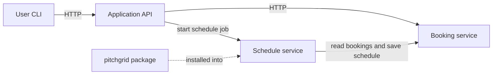

# Lifecycle plan

This plan is written before any feature is implemented. It is extended section by section; each section is committed before the work it describes begins.

## 1. Scope

### Purpose

A small system where players book football pitches in Brașov and view their own bookings. The admin is the pitch owner: they publish their pitches and see every booking made on them. The system is split into three services so that authorization can be studied across service boundaries.

### Roles

| Role | Type | What it can do |
|---|---|---|
| player | ordinary | List pitches, create a booking, see and cancel only their own bookings, request and download their own weekly schedule |
| admin | privileged | The pitch owner. Publishes and removes pitches, sees all bookings, cancels any booking. Does not create bookings. |

Seeded accounts (synthetic data, no registration):

- `Messi` (player)
- `Ronaldo` (player)
- `admin` (admin, the pitch owner)

One admin is seeded, so "all bookings" and "bookings on the admin's pitches" are the same set. Two players are needed so that tests can show one player cannot reach the other player's bookings or schedules.

### Entities

| Entity | Fields | Owner |
|---|---|---|
| Pitch | id, name, address, price_per_hour | the admin who published it |
| Booking | id, pitch_id, user_id, date, start_hour, status | the player who created it |

Generated result (not a main entity): **Schedule**: id, owner_id, week, content, created_at. It is owned by the player who requested it.

### Components

Each component runs as a separate process in its own container. They communicate over HTTP with JSON.

| Component | Responsibility | Security responsibility |
|---|---|---|
| Application API (`api`) | The only entry point for users. Handles login and forwards requests to the other services. | Establishes who the user is and what role they have. Rejects unauthenticated requests. |
| Booking service (`booking-service`) | Stores pitches, bookings and schedules. | Checks permission on every resource and action, including requests coming from the other services. |
| Schedule service (`schedule-service`) | Builds a weekly schedule from a player's bookings using the helper package. | Works only on the data needed for the one job it was given. |

Data store: one SQLite database, opened only by the Booking service. The other two components never touch it directly.

### Helper package (external dependency)

`pitchgrid`: takes a list of bookings and returns a weekly timetable as formatted text. It lives in its own directory, is built as an installable package, and is declared as a dependency of the Schedule service. Its code is not copied into any component.

### Operations

| # | Operation | Who | Path |
|---|---|---|---|
| 1 | Log in and receive a token | player, admin | User → API |
| 2 | List pitches | player, admin | User → API → Booking service |
| 3 | Create a booking (rejected if the slot is taken) | player | User → API → Booking service |
| 4 | List or cancel own bookings | player | User → API → Booking service |
| 5 | Request weekly schedule, then download it | player | User → API → Schedule service → Booking service → `pitchgrid` → Booking service → API → User |
| 6 | Publish or remove a pitch | admin | User → API → Booking service |
| 7 | List all bookings, cancel any booking | admin | User → API → Booking service |

Operation 5 involves all three components and the helper package.

### User interface

A command-line client or an API test collection. No graphical interface.

### Out of scope

Account registration, web or mobile interface, real payments, email, public hosting, high availability, performance at scale.

## Sections to be added

2. Asset register
3. Trust boundaries and data flow
4. Access control matrix
5. STRIDE analysis
6. Phase plan: requirements, implementation and build, testing, release (asset → threat → control → activity → evidence → gate)