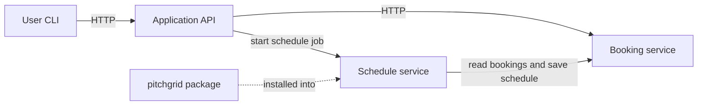
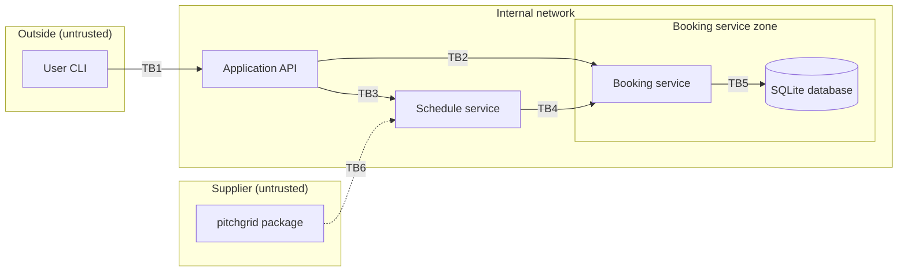
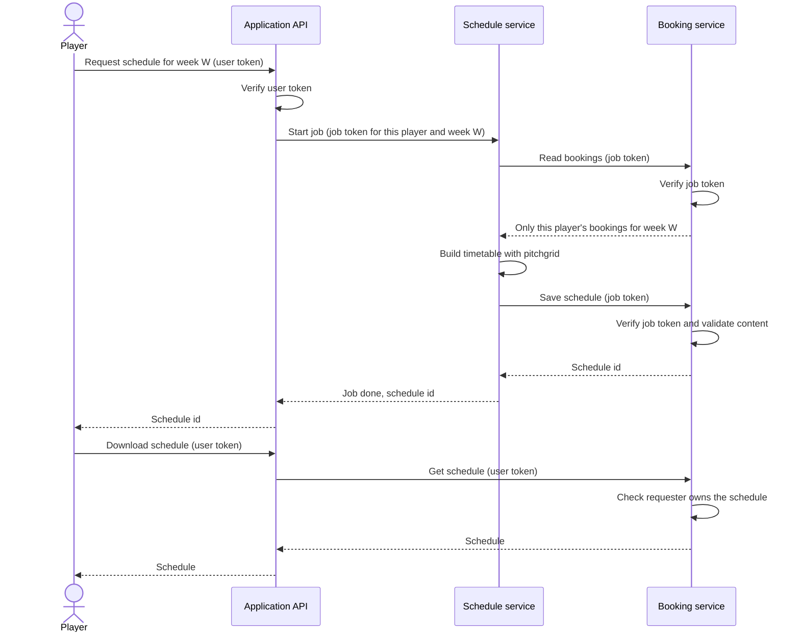

# Lifecycle plan

This plan is written before any feature is implemented. It is extended section by section; each section is committed before the work it describes begins.

## 1. Scope

### Purpose

A small system where players book football pitches in Brașov and view their own bookings. The admin is the pitch owner: they publish their pitches and see every booking made on them. The system is split into three services so that authorization can be studied across service boundaries.

### Roles

| Role | Type | What it can do |
|---|---|---|
| player | ordinary | List pitches, create a booking, see and cancel only their own bookings, request and download their own weekly schedule |
| admin | privileged | The pitch owner. Publishes and removes pitches, sees all bookings, cancels any booking. Does not create bookings. |

Seeded accounts (synthetic data, no registration):

- `andrei` (player)
- `maria` (player)
- `admin` (admin, the pitch owner)

One admin is seeded, so "all bookings" and "bookings on the admin's pitches" are the same set. Two players are needed so that tests can show one player cannot reach the other player's bookings or schedules.

### Entities

| Entity | Fields | Owner |
|---|---|---|
| Pitch | id, name, address, price_per_hour | the admin who published it |
| Booking | id, pitch_id, user_id, date, start_hour, status | the player who created it |

Generated result (not a main entity): **Schedule**: id, owner_id, week, content, created_at. It is owned by the player who requested it.

### Components

Each component runs as a separate process in its own container. They communicate over HTTP with JSON.

| Component | Responsibility | Security responsibility |
|---|---|---|
| Application API (`api`) | The only entry point for users. Handles login and forwards requests to the other services. | Establishes who the user is and what role they have. Rejects unauthenticated requests. |
| Booking service (`booking-service`) | Stores pitches, bookings and schedules. | Checks permission on every resource and action, including requests coming from the other services. |
| Schedule service (`schedule-service`) | Builds a weekly schedule from a player's bookings using the helper package. | Works only on the data needed for the one job it was given. |

Data store: one SQLite database, opened only by the Booking service. The other two components never touch it directly.

### Helper package (external dependency)

`pitchgrid`: takes a list of bookings and returns a weekly timetable as formatted text. It lives in its own directory, is built as an installable package, and is declared as a dependency of the Schedule service. Its code is not copied into any component.

### Operations

| # | Operation | Who | Path |
|---|---|---|---|
| 1 | Log in and receive a token | player, admin | User → API |
| 2 | List pitches | player, admin | User → API → Booking service |
| 3 | Create a booking (rejected if the slot is taken) | player | User → API → Booking service |
| 4 | List or cancel own bookings | player | User → API → Booking service |
| 5 | Request weekly schedule, then download it | player | User → API → Schedule service → Booking service → `pitchgrid` → Booking service → API → User |
| 6 | Publish or remove a pitch | admin | User → API → Booking service |
| 7 | List all bookings, cancel any booking | admin | User → API → Booking service |

Operation 5 involves all three components and the helper package.

### User interface

A command-line client or an API test collection. No graphical interface.

### Out of scope

Account registration, web or mobile interface, real payments, email, public hosting, high availability, performance at scale.

## 2. Asset register

An asset is anything in the system that is worth protecting. Each asset is rated on three needs:

- **C (confidentiality):** only the right people can read it
- **I (integrity):** only the right people can change it
- **A (availability):** it is there when needed

Ratings: H = high, M = medium, L = low.

| ID | Asset | Where it lives | Owner | C | I | A | Why it matters |
|---|---|---|---|---|---|---|---|
| A1 | User credentials (password hashes) | API, seeded user store | each user | H | H | M | Whoever has them can log in as that user |
| A2 | User access tokens | Issued by API, sent with every request | each user | H | H | L | A stolen or forged token gives the user's authority until it expires |
| A3 | Signing keys and service secrets | Configuration of each service | system | H | H | M | Whoever has them can create valid tokens for any user or service |
| A4 | Bookings | Booking service database | the player who created it | M | H | M | Show who plays where and when; must not be changed or cancelled by others |
| A5 | Pitches | Booking service database | admin | L | H | M | Visible to all users, but only the admin may change them |
| A6 | Schedules (generated results) | Booking service database | the player who requested it | M | H | L | Contain a player's bookings; must reach only that player |
| A7 | Job authority (what the Schedule service is allowed to read for one job) | Passed from API to Schedule service to Booking service | the player who started the job | H | H | L | If it is too broad, the Schedule service can read other players' data |
| A8 | Helper package `pitchgrid` and its approval manifest | Package directory; manifest in the Schedule service build | system | L | H | M | A modified package runs with the Schedule service's permissions |
| A9 | Source code, Jenkinsfile, container images | Git repository, build environment | system | L | H | M | Changes here change what every service does |
| A10 | Logs, test and analysis results | Service output, Jenkins artifacts | system | M | H | L | Evidence for gate decisions; must not contain secrets or tokens |

## 3. Trust boundaries and data flow

A trust boundary is a point where data passes from one party to another that should not simply believe it. Everything that crosses a boundary is checked by the receiver.

### Zones

Only the Application API is reachable from outside. The Booking service and the Schedule service listen only on the internal network.

### Boundaries

| ID | Boundary | What crosses | The receiver must not assume | Planned control |
|---|---|---|---|---|
| TB1 | User → API | Username and password, user token, request data | That the caller is who they claim to be, or that the input is well formed | Login required; token verified on every request; input validated |
| TB2 | API → Booking service | User token, request data | That a request is allowed just because it came from the API | Booking service verifies the token itself and checks role and ownership for each resource |
| TB3 | API → Schedule service | Job request, job token | That every job request is legitimate | Accepts only job tokens issued by the API; never receives the user token |
| TB4 | Schedule service → Booking service | Job token, read request, schedule to save | That the Schedule service may read whatever it asks for | Job token limits access to one player, one week, the actions "read bookings" and "save schedule", and a short lifetime; schedule content is validated before it is stored |
| TB5 | Booking service → database | SQL queries built from request data | That request data is safe to place in a query | Parameterized queries; database file accessible only to the Booking service container |
| TB6 | Supplier → Schedule service build | Package artifact | That a package with the right name and version is the approved one | Manifest controlled by the consumer with a SHA-256 digest; build fails on mismatch; Schedule service has no database access and no user tokens |

### Where trust is established

- **Identity:** at the API, when the user logs in.
- **Authority:** in tokens issued by the API. The user token carries the user id, role, intended services and expiry. The job token carries the player, the week, the allowed actions, the target service and expiry.
- **Ownership:** in the Booking service, which records the owner on every booking and schedule and compares it with the token on every request.
- **Dependency trust:** in the approval manifest, checked when the Schedule service is built.

### Data flow for operation 5 (weekly schedule)

## 4. Access control matrix

The matrix states who may perform which action. **Anything not listed here is denied.**

### Users

| Action | Anonymous | Player | Admin |
|---|---|---|---|
| Log in | yes | yes | yes |
| List pitches | no | yes | yes |
| Publish a pitch | no | no | yes |
| Remove a pitch | no | no | yes |
| Create a booking | no | yes, for themselves only | no |
| List bookings | no | own only | all |
| View one booking | no | own only | all |
| Cancel a booking | no | own only | any |
| Request a weekly schedule | no | yes, from own bookings only | no |
| Download a schedule | no | own only | no |

### Services

| Caller → target | Credential | Allowed | Not allowed |
|---|---|---|---|
| API → Booking service | The user's token | Forward the user's request; the Booking service applies the user matrix above | Any request without a valid user token |
| API → Schedule service | Job token created by the API | Start one schedule job | Anything else |
| Schedule service → Booking service | Job token | Read the bookings of the player and week named in the token; save one schedule owned by that player | Read other players' bookings, read any schedule, create or cancel bookings, change pitches |
| Schedule service → API | none | nothing | everything |
| Booking service → any service | none | nothing; it only answers requests | everything |
| `pitchgrid` package | none | Receive a list of bookings as input and return text | Network access, file access, reading tokens or environment secrets |

### Rules

- The owner of a new booking or schedule is taken from the token, never from the request body.
- A request with no valid token is answered with `401 Unauthorized`.
- A request with a valid token for an action that is not allowed is answered with `403 Forbidden`.
- Each "no", "own only" and "not allowed" entry in this section has at least one test that expects the request to be rejected.

## Sections to be added

5. STRIDE analysis
6. Phase plan: requirements, implementation and build, testing, release (asset → threat → control → activity → evidence → gate)